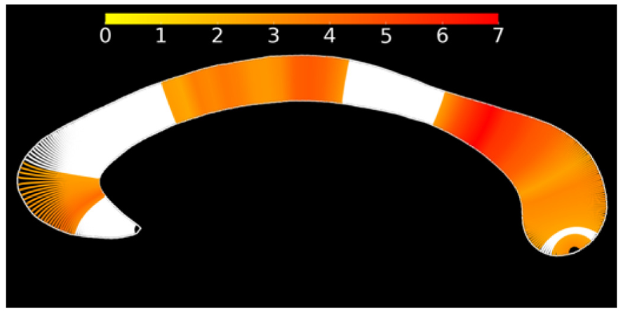

Cognitive impairment is an important and integral part of multiple sclerosis. Throughout the past decade, our group has worked on several aspects of CI leading to several key publications :

## Characterizing cognitive impairment and deterioration
{style="font-size: 1.2rem; background: #FFB76B; background: linear-gradient(to right, #FFB76B 0%, #FFA73D 30%, #FF7C00 60%, #FF7F04 100%); -webkit-background-clip: text; -webkit-text-fill-color: transparent;"}

In [Van Schependom et al](../../publication/pmid-24850580/pmid-24850580.pdf), we have shown that the symbol digit modalities test (SDMT) acts as an excellent sentinel test for impairment in different cognitive domains. Furthermore, we demonstrated that patients tend to accrue impairment first on information processing speed and hypothesized that reduced information processing speed may even drive poor performance on other cognitive tests. 

## Developing multimodal biomarkers for cognitive impairment
{style="font-size: 1.2rem; background: #FFB76B; background: linear-gradient(to right, #FFB76B 0%, #FFA73D 30%, #FF7C00 60%, #FF7F04 100%); -webkit-background-clip: text; -webkit-text-fill-color: transparent;"}

As cognitive impairment is notoriously difficult and costly to assess in MS, we have worked on the development of novel, more objective markers of cognitive impairment by analysing the P300 waveform, [shape analysis of the corpus callosum](../../publication/pmid-28438714),  [fMRI functional connectivity analysis](../../publication/pmid-3795779/), [MEG dynamic networks](../../publication/pmid-31361073/pmid-31361073.pdf) and [serum/CSF biomarkers](../../publication/pmid-36059263). 

My pipeline to automatically segment the corpus callosum was validated in both Alzheimer's disease and multiple sclerosis (see [here](../../publication/pmid-27830115)) and enabled used to capture morphological changes of the corpus callosum in the very early stages of the disease (see [here](../../publication/pmid-29984160))

For more information on neurophysiological biomarkers, check [my project page here](../Neurophysiology/)

## Capturing cognitive deterioration in the clinic
{style="font-size: 1.2rem; background: #FFB76B; background: linear-gradient(to right, #FFB76B 0%, #FFA73D 30%, #FF7C00 60%, #FF7F04 100%); -webkit-background-clip: text; -webkit-text-fill-color: transparent;"}

We are working on an app-based cognitive test (coming soon) as well as deep learning on structural brain images. Please check [Stijn Denissens](https://scholar.google.com/citations?view_op=view_citation&hl=nl&user=H9KHafoAAAAJ&citation_for_view=H9KHafoAAAAJ:Se3iqnhoufwC)'s work [here](https://scholar.google.com/citations?view_op=view_citation&hl=nl&user=H9KHafoAAAAJ&citation_for_view=H9KHafoAAAAJ:Se3iqnhoufwC)

## New treatment designs for CI in MS
{style="font-size: 1.2rem; background: #FFB76B; background: linear-gradient(to right, #FFB76B 0%, #FFA73D 30%, #FF7C00 60%, #FF7F04 100%); -webkit-background-clip: text; -webkit-text-fill-color: transparent;"}

As cognitive impairment is difficult to treat, we are working on novel treatment designs. Delphine Van Laethem is investigating the beneficial effects of combined physical/cognitive training and I am exploring if non-invasive neuromodulation could provide a new way to sustainably enhance cognition in people with MS. 