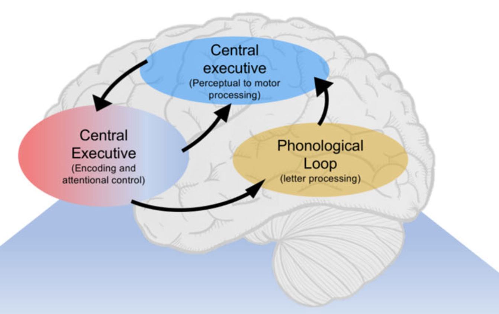

As cognitive impairment is difficult to assess objectively, people have been looking into the brain’s functioning to increase our understanding how neurodegenerative diseases affect neurophysiological functioning. 

## Brain dynamics
{style="font-size: 1.2rem; background: #FFB76B; background: linear-gradient(to right, #FFB76B 0%, #FFA73D 30%, #FF7C00 60%, #FF7F04 100%); -webkit-background-clip: text; -webkit-text-fill-color: transparent;"}

Many techniques have been developed - and are still under development - that enable not only static functional connectivity analyses, but also the analysis of short-lived transient brain states. These brain states can be characterized by a unique spatial, temporal and spectral profile. In contrast to static approaches these short-lived states open a window on the timescales at which cognition unfolds, i.e. in the range of tens of milliseconds. Our results on brain dynamics in MS have been published [here](../../publication/pmid31361073/cite.bib). 

[Chiara Rossi](https://aims.research.vub.be/en/chiara-rossi) has recently moved this forward to task-based MEG data published in [Communications Biology](../../publication/pmid-37872313). 

## Spectral analyses
{style="font-size: 1.2rem; background: #FFB76B; background: linear-gradient(to right, #FFB76B 0%, #FFA73D 30%, #FF7C00 60%, #FF7F04 100%); -webkit-background-clip: text; -webkit-text-fill-color: transparent;"}

The alpha band has been frequently linked to cogntive impairment in MS. But how specific is this correlation? Find out in [our recent work](../../publication/pmid-37326133/) where we demonstrate that alpha most strongly correlates with information processing speed. 

## Excitation/inhibition
{style="font-size: 1.2rem; background: #FFB76B; background: linear-gradient(to right, #FFB76B 0%, #FFA73D 30%, #FF7C00 60%, #FF7F04 100%); -webkit-background-clip: text; -webkit-text-fill-color: transparent;"}
As sustained oscillations have been hypothesized to underlie brain communuction - and hence - cognitive functioning, the 1/f spectral slope has been suggested as a marker of excitation/inhibition balance. [Fahimeh Akbarian](https://aims.research.vub.be/en/fahimeh-akbarian) has demonstrated that the 1/f slope changes in the expected direction when benzodiazepines - a common symptomatic treatment in MS - are administered. For more details, see her [great work](../../publication/pmid-37672569) published in HBM!

## Methodological caveats
{style="font-size: 1.2rem; background: #FFB76B; background: linear-gradient(to right, #FFB76B 0%, #FFA73D 30%, #FF7C00 60%, #FF7F04 100%); -webkit-background-clip: text; -webkit-text-fill-color: transparent;"}

However, application of these methods to people with neurodegenerative diseases comes with important caveats. 
-- We have previously demonstrated that differences in network parameters based on fMRI data are driven by differences in temporal Signal-to-Noise ratio and/or Contrast-to-noise ratio. We hypothesize this is due to a reduced perfusion and thus a reduced signal quality in people with MS, see [Johan Baijot's work](../../publication/pmid-33795779/pmid-33795779.pdf) for more details.
-- While EEG and/or MEG can provide network estimates independent from vascular effects, they are strongly influenced by the use of benzodiazepines. Benzodiazepines are prescribed to people with MS, e.g. to reduce feelings of anxiety, insomnia or tremor, but enhance beta power. We demonstrated that benzodiazepines induced effects stronger than the typical differences observed between someone with vs someone without MS. For more information, you can have a ook at the following publication: [HMM Analysis](../../publication/pmid31361073/cite.bib)

A proper understanding of what is driving the differences we see in fMRI and MEEG is an obvious prerequisite to develop novel biomarkers. 

Key-words: Power spectral analysis, alpha peak analysis; Network analysis; Dynamic network analysis 